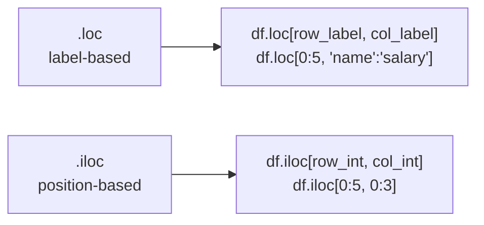

# Pandas Lesson 01 — DataFrames & Selection

> **Estimated time:** 35–45 minutes  
> **Run exercises:** `python pandas/lesson-01-dataframes-selection/lesson.py`

---

## Loading Data

```python
import pandas as pd

df = pd.read_csv("data/employees.csv")
df = pd.read_json("data/events.json")
df = pd.read_parquet("data/logs.parquet")
```

---

## Exploring a DataFrame

```python
df.shape          # (74, 9) — rows, columns
df.dtypes         # data type of each column
df.info()         # dtypes + non-null counts
df.head(5)        # first 5 rows
df.tail(3)        # last 3 rows
df.describe()     # stats for numeric columns
df.columns        # column names
df["salary"].unique()         # unique values
df["department"].value_counts() # frequency count
```

---

## Selecting Columns

```python
df["salary"]                        # single column → Series
df[["name", "salary", "department"]] # multiple columns → DataFrame
```

---

## .loc vs .iloc



```python
df.loc[0, "name"]             # row with index 0, column "name"
df.loc[0:4, ["name","salary"]] # rows 0-4 (inclusive), two columns
df.iloc[0, 0]                  # row 0, column 0
df.iloc[0:5, 0:3]              # rows 0-4, columns 0-2 (end exclusive)
```

> 💡 `.loc` end is **inclusive**. `.iloc` end is **exclusive** (like Python slicing).

---

## Boolean Masks (Filtering)

```python
# Single condition
df[df["department"] == "Cyber"]

# Multiple conditions — use & (and), | (or), ~ (not)
# ALWAYS wrap each condition in parentheses
df[(df["department"] == "Cyber") & (df["salary"] > 120000)]
df[(df["clearance"] == "Secret") | (df["clearance"] == "Top Secret")]
df[~(df["active"] == 0)]     # NOT inactive

# .isin() — equivalent to SQL IN
df[df["department"].isin(["Cyber", "Engineering"])]

# String methods
df[df["role"].str.contains("Analyst")]
df[df["name"].str.startswith("A")]
```

---

## ✅ You're Ready When You Can Answer

- What is the difference between df["col"] and df[["col"]]?
- What is the difference between .loc and .iloc?
- How do you combine two filter conditions with AND in pandas?
- What does .isin() do?
- What does df.dtypes tell you?

---

**Next:** `python pandas/lesson-01-dataframes-selection/lesson.py`
