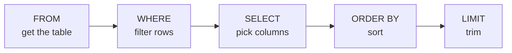

# SQL Lesson 01 — SELECT & Filtering

> **Estimated time:** 30–45 minutes  
> **Run exercises:** `python lesson.py`  
> **Dataset:** `employees`, `departments` (see `/data/`)

---

## The Dataset

Every lesson in this repo uses the same five tables. Get familiar with them now —
you'll be querying them all the way through the capstone.

```
employees          contracts           employee_contracts
──────────────     ──────────────      ──────────────────
employee_id   PK   contract_id    PK   assignment_id  PK
name               contract_name       employee_id    FK
department_id  FK  department_id  FK   contract_id    FK
department         department          role
role               start_date          start_date
salary             end_date
hire_date          value
clearance          status
active

departments        security_events
───────────        ───────────────
department_id  PK  event_id       PK
department_name    employee_id    FK
division           event_type
                   severity
                   source_ip
                   dest_ip
                   timestamp
                   resolved
```

---

## Core Concept: The SELECT Statement

Every SQL query starts with `SELECT`. The basic structure is:

```sql
SELECT  column1, column2       -- what columns to return
FROM    table_name             -- where to get the data
WHERE   condition              -- which rows to include (optional)
ORDER BY column ASC/DESC       -- how to sort (optional)
LIMIT   n                      -- max rows to return (optional)
```

The database executes these clauses in a specific order that is **not** the same
as the order you write them:



> This order matters later. It's why you can't use a SELECT alias inside a WHERE clause —
> WHERE runs before SELECT has named anything yet.

---

## SELECT Basics

```sql
-- All columns
SELECT * FROM employees;

-- Specific columns
SELECT name, department, salary FROM employees;

-- Rename a column with an alias
SELECT name, salary AS annual_salary FROM employees;

-- Simple math in SELECT
SELECT name, salary, salary / 12 AS monthly_salary FROM employees;
```

---

## WHERE — Filtering Rows

`WHERE` narrows down which rows are returned. It uses comparison and logical operators.

### Comparison operators

| Operator | Meaning | Example |
|----------|---------|---------|
| `=`  | equals | `WHERE department = 'Cyber'` |
| `!=` or `<>` | not equal | `WHERE active != 0` |
| `>`  | greater than | `WHERE salary > 100000` |
| `>=` | greater than or equal | `WHERE salary >= 90000` |
| `<`  | less than | `WHERE hire_date < '2020-01-01'` |

### Logical operators: AND, OR, NOT

```sql
-- AND: both conditions must be true
SELECT name, department, salary
FROM employees
WHERE department = 'Cyber' AND salary > 120000;

-- OR: either condition can be true
SELECT name, clearance
FROM employees
WHERE clearance = 'Top Secret' OR clearance = 'Secret';

-- NOT: inverts the condition
SELECT name, active
FROM employees
WHERE NOT active = 0;
```

> ⚠️ **Operator precedence:** AND evaluates before OR, just like multiplication before addition.
> Use parentheses when mixing them to make intent explicit.

```sql
-- Without parens — may not do what you intend
WHERE department = 'Cyber' OR department = 'Engineering' AND salary > 100000

-- With parens — clear and correct
WHERE (department = 'Cyber' OR department = 'Engineering') AND salary > 100000
```

---

## IN — Matching a List of Values

`IN` is a cleaner way to write multiple OR conditions on the same column.

```sql
-- Verbose OR version
WHERE clearance = 'Secret' OR clearance = 'Top Secret'

-- Clean IN version (same result)
WHERE clearance IN ('Secret', 'Top Secret')

-- NOT IN — exclude a list
WHERE department NOT IN ('Finance', 'Logistics')
```

---

## BETWEEN — Range Filtering

`BETWEEN` is inclusive on both ends.

```sql
-- Salary between 80k and 120k (includes 80000 and 120000)
WHERE salary BETWEEN 80000 AND 120000

-- Date range
WHERE hire_date BETWEEN '2020-01-01' AND '2022-12-31'
```

---

## LIKE — Pattern Matching

`LIKE` matches string patterns using wildcards.

| Wildcard | Meaning | Example |
|----------|---------|---------|
| `%` | any sequence of characters | `'Cyber%'` matches "Cyber", "Cybersecurity" |
| `_` | exactly one character | `'Analyst _'` matches "Analyst I", "Analyst V" |

```sql
-- Names starting with 'A'
WHERE name LIKE 'A%'

-- Roles containing the word 'Analyst'
WHERE role LIKE '%Analyst%'

-- Exactly one character after 'Analyst '
WHERE role LIKE 'Analyst _'
```

> 💡 `LIKE` is case-sensitive in most databases. Snowflake has `ILIKE` for
> case-insensitive matching — we'll cover that in the Snowflake reference docs.

---

## IS NULL / IS NOT NULL

`NULL` means "no value" — it is not the same as zero or an empty string.
You **cannot** use `= NULL`. You must use `IS NULL`.

```sql
-- Wrong — will return no rows even if NULLs exist
WHERE clearance = NULL

-- Correct
WHERE clearance IS NULL

-- Find rows that DO have a value
WHERE clearance IS NOT NULL
```

---

## DISTINCT — Removing Duplicates

```sql
-- All unique department names
SELECT DISTINCT department FROM employees;

-- All unique clearance levels that exist
SELECT DISTINCT clearance FROM employees ORDER BY clearance;
```

---

## ORDER BY and LIMIT

```sql
-- Highest salaries first
SELECT name, salary FROM employees ORDER BY salary DESC;

-- Alphabetical by name
SELECT name, department FROM employees ORDER BY name ASC;

-- Top 5 highest paid
SELECT name, salary FROM employees ORDER BY salary DESC LIMIT 5;

-- Order by multiple columns
SELECT name, department, salary
FROM employees
ORDER BY department ASC, salary DESC;
```

---

## Putting It Together

```sql
-- Cyber or Engineering employees with Secret+ clearance hired after 2020,
-- sorted by salary descending, top 10 only
SELECT
    name,
    department,
    role,
    salary,
    clearance
FROM employees
WHERE department IN ('Cyber', 'Engineering')
  AND clearance IN ('Secret', 'Top Secret')
  AND hire_date > '2020-01-01'
ORDER BY salary DESC
LIMIT 10;
```

---

## ✅ You're Ready When You Can Answer

- What order does SQL actually execute SELECT, WHERE, FROM, ORDER BY, LIMIT?
- What is the difference between `IN` and `BETWEEN`?
- Why can't you write `WHERE clearance = NULL`?
- What does `%` mean in a LIKE pattern?
- If you mix AND and OR without parentheses, which runs first?

---

**Next:** Open `lesson.py` and run `python lesson.py`
