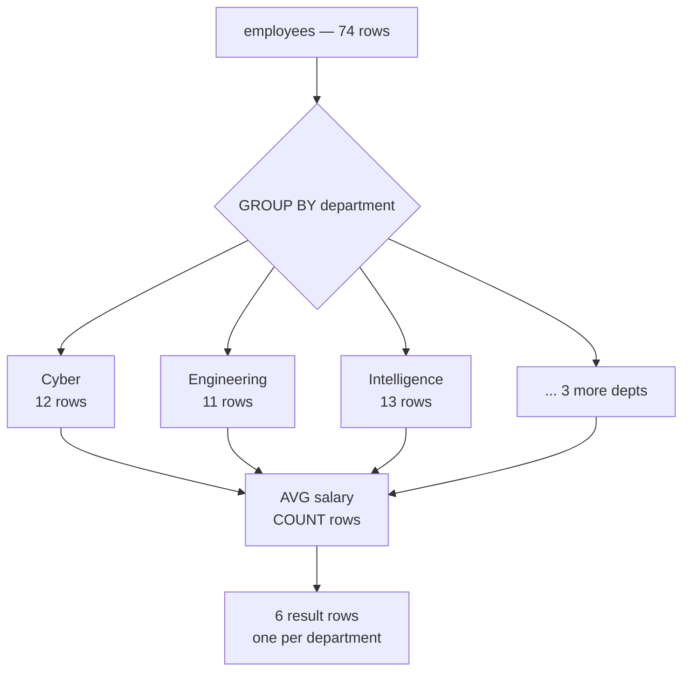

# SQL Lesson 02 — Aggregation

> **Estimated time:** 30–45 minutes  
> **Run exercises:** `python sql/lesson-02-aggregation/lesson.py`  
> **Tables used:** `employees`, `security_events`, `contracts`

---

## What Is Aggregation?

Aggregation collapses many rows into a single summary value.  
Where `SELECT` returns one row per input row, aggregate functions return one row per **group**.

```
employees (74 rows)          After GROUP BY department:
─────────────────────        ──────────────────────────────────
name        department       department    avg_salary   headcount
──────────  ──────────  →    ──────────    ──────────   ─────────
Alex        Cyber            Cyber         122000       12
Jordan      Cyber            Engineering   118000       11
Taylor      Engineering      Intelligence  95000        13
...                          ...
```

---

## The Aggregate Functions

| Function | What it does | Notes |
|----------|-------------|-------|
| `COUNT(*)` | counts all rows | includes NULLs |
| `COUNT(col)` | counts non-NULL values in col | excludes NULLs |
| `COUNT(DISTINCT col)` | counts unique non-NULL values | |
| `SUM(col)` | total of all values | |
| `AVG(col)` | arithmetic mean | excludes NULLs |
| `MIN(col)` | smallest value | works on dates too |
| `MAX(col)` | largest value | works on dates too |

```sql
SELECT
    COUNT(*)                    AS total_employees,
    COUNT(clearance)            AS employees_with_clearance,
    COUNT(DISTINCT department)  AS unique_departments,
    SUM(salary)                 AS total_payroll,
    AVG(salary)                 AS avg_salary,
    MIN(salary)                 AS lowest_salary,
    MAX(salary)                 AS highest_salary
FROM employees;
```

---

## GROUP BY

`GROUP BY` splits rows into groups and applies the aggregate function to each group separately.

```sql
-- Average salary per department
SELECT
    department,
    AVG(salary) AS avg_salary,
    COUNT(*)    AS headcount
FROM employees
GROUP BY department
ORDER BY avg_salary DESC;
```



> ⚠️ **Rule:** Every column in SELECT must either be in GROUP BY or wrapped in an aggregate function.  
> This is the most common GROUP BY mistake.

```sql
-- WRONG — name is not in GROUP BY and not aggregated
SELECT name, department, AVG(salary)
FROM employees
GROUP BY department;

-- CORRECT
SELECT department, AVG(salary) AS avg_salary
FROM employees
GROUP BY department;
```

---

## HAVING — Filtering Groups

`WHERE` filters rows **before** grouping.  
`HAVING` filters groups **after** aggregation.


```sql
-- Departments with more than 10 employees AND avg salary over 100k
SELECT
    department,
    COUNT(*)    AS headcount,
    AVG(salary) AS avg_salary
FROM employees
GROUP BY department
HAVING COUNT(*) > 10
   AND AVG(salary) > 100000;
```

> 💡 You can use aggregate functions in HAVING even if they're not in SELECT.

---

## WHERE vs HAVING — The Key Distinction

```sql
-- WHERE: filter individual rows before grouping
-- Only count active employees per department
SELECT department, COUNT(*) AS active_count
FROM employees
WHERE active = 1          -- runs BEFORE GROUP BY
GROUP BY department;

-- HAVING: filter groups after aggregation
-- Only show departments where active headcount > 8
SELECT department, COUNT(*) AS active_count
FROM employees
WHERE active = 1
GROUP BY department
HAVING COUNT(*) > 8;      -- runs AFTER GROUP BY
```

---

## NULLs in Aggregates

`COUNT(*)` counts every row including NULLs.  
`COUNT(col)`, `SUM`, `AVG`, `MIN`, `MAX` all **ignore NULL values**.

```sql
-- If 5 employees have NULL clearance:
SELECT
    COUNT(*)         AS all_employees,      -- 74
    COUNT(clearance) AS with_clearance,     -- 69 (ignores NULLs)
    COUNT(DISTINCT clearance) AS unique_clearances  -- ignores NULLs
FROM employees;
```

---

## Combining WHERE, GROUP BY, and HAVING

```sql
-- Among active employees in technical departments,
-- find departments with more than 5 Top Secret employees
SELECT
    department,
    COUNT(*) AS top_secret_count
FROM employees
WHERE active = 1
  AND division = 'Technical'        -- wait — division isn't in employees...
GROUP BY department
HAVING COUNT(*) > 5
ORDER BY top_secret_count DESC;
```

> 💡 You can only use columns that exist in the table in WHERE.  
> In the exercises you'll join to get division — that's Lesson 03.

---

## ✅ You're Ready When You Can Answer

- What is the difference between COUNT(*) and COUNT(col)?
- Why can't you use an aggregate function in a WHERE clause?
- What does HAVING do and when do you use it instead of WHERE?
- If a column has NULLs, how does AVG handle them?
- What is the rule for which columns can appear in SELECT when using GROUP BY?

---

**Next:** `python sql/lesson-02-aggregation/lesson.py`
