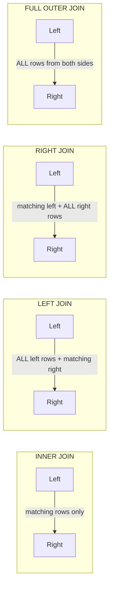

# SQL Lesson 03 — JOINs

> **Estimated time:** 45–60 minutes  
> **Run exercises:** `python sql/lesson-03-joins/lesson.py`  
> **Tables used:** `employees`, `departments`, `contracts`, `employee_contracts`, `security_events`

---

## Why JOINs Exist

Data is split across multiple tables to avoid repetition. JOINs let you combine them.

```
employees                    departments
─────────────────────        ────────────────────────
employee_id  department_id   department_id  dept_name
1001         1          ──►  1              Engineering
1002         2          ──►  2              Cyber
1003         1               ...
```

A JOIN connects rows from two tables using a shared key — in this case `department_id`.

---

## The Four JOIN Types



### INNER JOIN
Returns only rows that have a match in **both** tables.

```sql
SELECT e.name, e.salary, d.division
FROM employees e
INNER JOIN departments d ON e.department_id = d.department_id;
```

### LEFT JOIN
Returns **all rows from the left table**, plus matching rows from the right.  
If no match exists on the right, those columns are NULL.

```sql
-- All employees, with their department info if it exists
SELECT e.name, d.division
FROM employees e
LEFT JOIN departments d ON e.department_id = d.department_id;
-- Employees with no matching department still appear, division = NULL
```

### RIGHT JOIN
Mirror of LEFT JOIN — all rows from the right table, matched rows from the left.  
Rarely used (just swap the table order and use LEFT JOIN instead).

### FULL OUTER JOIN
Returns all rows from both tables, NULLs on whichever side has no match.

---

## Table Aliases

Always alias your tables when joining — it keeps queries readable.

```sql
-- Without aliases (messy)
SELECT employees.name, departments.division
FROM employees INNER JOIN departments ON employees.department_id = departments.department_id;

-- With aliases (clean)
SELECT e.name, d.division
FROM employees e
INNER JOIN departments d ON e.department_id = d.department_id;
```

---

## NULL Behavior in JOINs

This is where JOINs get tricky. NULLs never match anything — including other NULLs.

```sql
-- If an employee has department_id = NULL, they will NOT appear in an INNER JOIN
-- They WILL appear in a LEFT JOIN, but with NULL values for all department columns

SELECT e.name, d.department_name
FROM employees e
LEFT JOIN departments d ON e.department_id = d.department_id
WHERE d.department_id IS NULL;  -- finds employees with no matching department
```

---

## Anti-Join Pattern

An anti-join finds rows in the left table that have **no match** in the right table.

```sql
-- Employees not assigned to any contract
SELECT e.name, e.department
FROM employees e
LEFT JOIN employee_contracts ec ON e.employee_id = ec.employee_id
WHERE ec.employee_id IS NULL;
```

---

## Joining More Than Two Tables

```sql
SELECT
    e.name,
    e.salary,
    d.division,
    c.contract_name,
    ec.role AS contract_role
FROM employees e
INNER JOIN departments d        ON e.department_id   = d.department_id
INNER JOIN employee_contracts ec ON e.employee_id    = ec.employee_id
INNER JOIN contracts c           ON ec.contract_id   = c.contract_id;
```

---

## Joining on Multiple Conditions

```sql
SELECT *
FROM table_a a
JOIN table_b b ON a.id = b.id
             AND a.date = b.date;  -- additional join condition
```

---

## ✅ You're Ready When You Can Answer

- What rows does a LEFT JOIN return that an INNER JOIN doesn't?
- If a left table has 50 rows and every row matches the right table, how many rows does a LEFT JOIN return?
- How do you find rows in table A that have no match in table B?
- Why does a NULL in the join key cause a row to be excluded from an INNER JOIN?
- What is the difference between filtering in ON vs WHERE for a LEFT JOIN?

---

**Next:** `python sql/lesson-03-joins/lesson.py`
