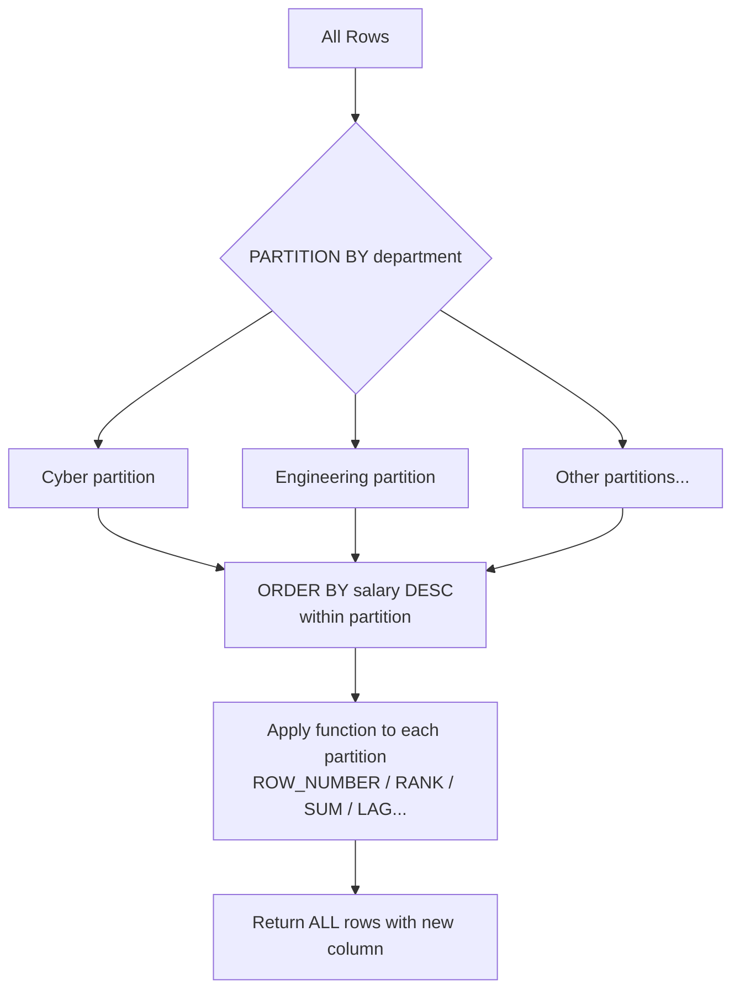

# SQL Lesson 05 — Window Functions

> **Estimated time:** 45–60 minutes  
> **Run exercises:** `python sql/lesson-05-window-functions/lesson.py`  
> **Tables used:** `employees`, `security_events`, `contracts`

---

## What Makes Window Functions Different

A regular aggregate collapses rows into one per group.  
A window function **keeps all rows** and adds a computed column alongside them.

```
GROUP BY dept (collapses):     Window function (preserves):
────────────────────           ────────────────────────────────────────
dept       | avg_salary        name      | dept   | salary | dept_avg
───────────+───────────        ──────────+────────+────────+─────────
Cyber      | 122000            Alex      | Cyber  | 140000 | 122000
Logistics  | 72000             Jordan    | Cyber  | 115000 | 122000
                               Morgan    | Cyber  | 111000 | 122000
Rows gone                      All rows kept
```

---

## Anatomy of OVER()

```sql
FUNCTION() OVER (
    PARTITION BY col   -- groups rows (like GROUP BY, but keeps all rows)
    ORDER BY col DESC  -- ordering within each partition
)
```



---

## ROW_NUMBER, RANK, DENSE_RANK

All three number rows within a partition. They differ on ties:

```
salary    ROW_NUMBER   RANK   DENSE_RANK
───────   ──────────   ────   ──────────
140000        1          1        1
115000        2          2        2
115000        3          2        2    ← tie: same RANK and DENSE_RANK
111000        4          4        3    ← RANK skips to 4, DENSE_RANK goes to 3
```

- `ROW_NUMBER` — always unique, never ties
- `RANK` — ties share a rank, next rank skips
- `DENSE_RANK` — ties share a rank, no skipping ← use this for "top N" queries

---

## Running Totals and Partition Aggregates

```sql
-- Running total: ORDER BY inside OVER makes it cumulative
SUM(salary) OVER (PARTITION BY department ORDER BY hire_date) AS running_total

-- Full partition total: no ORDER BY = entire partition
SUM(salary) OVER (PARTITION BY department) AS dept_total
```

> ⚠️ The presence or absence of `ORDER BY` inside `OVER()` is the entire difference
> between a running total and a partition total. This trips everyone up at first.

---

## LAG and LEAD

Look at adjacent rows without a self-join.

```sql
LAG(col, offset, default)   OVER (PARTITION BY ... ORDER BY ...)
LEAD(col, offset, default)  OVER (PARTITION BY ... ORDER BY ...)
```

```sql
-- Salary difference from previous hire in same department
LAG(salary, 1, 0) OVER (PARTITION BY department ORDER BY hire_date) AS prev_salary
```

- `offset` — how many rows back/forward (default 1)
- `default` — what to return when there's no previous/next row (default NULL)

---

## QUALIFY (Snowflake / DuckDB)

Filters window function results without needing a subquery.  
Think of it as `HAVING` for window functions.

```sql
-- Standard SQL (subquery required)
SELECT * FROM (
    SELECT *, DENSE_RANK() OVER (PARTITION BY department ORDER BY salary DESC) AS rnk
    FROM employees
) WHERE rnk <= 2;

-- With QUALIFY (Snowflake / DuckDB)
SELECT *, DENSE_RANK() OVER (PARTITION BY department ORDER BY salary DESC) AS rnk
FROM employees
QUALIFY rnk <= 2;
```

---

## ✅ You're Ready When You Can Answer

- What is the difference between RANK and DENSE_RANK?
- What does adding ORDER BY inside OVER() do to SUM()?
- What does LAG(salary, 1, 0) return for the first row in a partition?
- What does QUALIFY do and why is it useful?
- When would you use ROW_NUMBER instead of DENSE_RANK?

---

**Next:** `python sql/lesson-05-window-functions/lesson.py`
